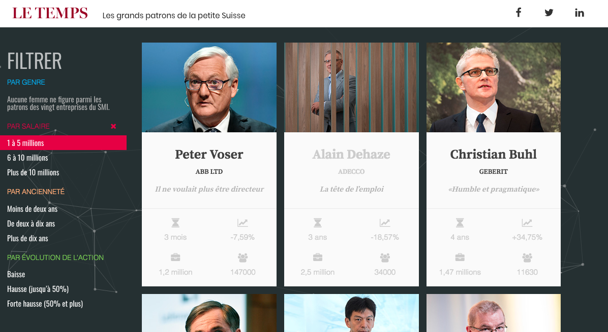
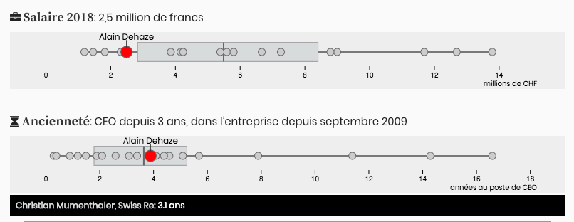

# Galerie interactive: les patrons du SMI

Les portraits en texte et en chiffres des patrons des plus grosses entreprises cotées de Suisse. Aperçu:

Grâce à d3.js, des mini-graphiques avec boîtes à moustaches (box and whisker plots) pour comparer salaire, ancienneté, actions détenues, nombre d’employés etc.:

Basé sur le template «Trombinoscope» de notre [boîte à outils](https://labs.letemps.ch/toolbox/) ([aussi sur GitHub](https://github.com/labsletemps/toolbox-templates)), par César Greppin

Pour générer une URL statique par portrait: [generate_pages.ipynb](generate_pages.ipynb)

Sous le capot: Handlebars, d3js, jQuery, Bootstrap, Fontawesome, Composer, CodeKit, particlesjs

Code sous [licence MIT](LICENCE.txt)
